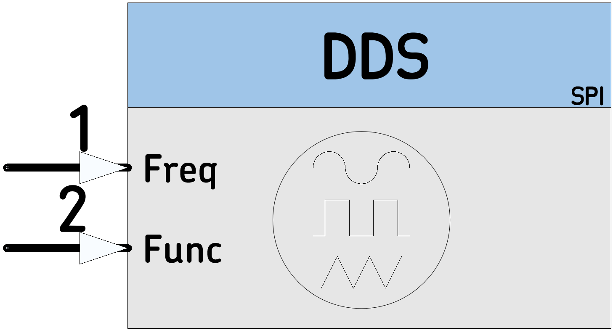

# [DDS](https://github.com/nBlocksStudioNodes/nblocks_DDS)

AD9833 DDS Generator Node, 1 Hz to 25 MHz in 1 Hz steps

----

----

  *  Category: Function
  *  HAL: mbed
  *  Status: Definition: LPC1768 40KHz 
  *  Author: Nikolaos Chalikias

## Inputs/Outputs
 *  (Schematic pin1) Frequency, accepts 2 types:
         *  uint16_t
         *  float
 *  (Schematic pin2) Function
         *  uint16_t : Function type 0=STOP, 1=Sinusoidal, 2=Triangle, 3= Rectangle

## Parameters

 *  PinName: pinMOSI: SPI pin to be connected to AD9833
 *  PinName: pinSCK: SPI pin to be connected to AD9833
 *  PinName: pinSelect: SPI Select pin:  in AD9833 datasheet is called FSYNC
 *  uint32_t: Frequency default, used if no Input frequency is received

## Example:
[Ticker]-->[Counter]-->[DDS]  	Scan frequency in 1 Hz steps
 

